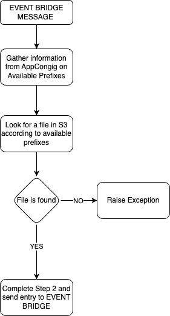

# woody_flipflop_parse_metadata_second_step

This repository represents second step in gathering, extracting and
updating metadata in sonyhive api platform. Inputs might be coming 
from many sources so the key to the overhaul flow is to be adaptive.

## Installation
This repository i just a representation of Lambda function stored in
company AWS account. Every test should be run in AWS and be verified
in CloudWatch. Main function and a starting point of this step starts
with lambda.py, and it's handler() 

## Usage

### High level overview
Below we present high level overview of the algorithm for the Second
step.

<div align="center">
  
</div>

Second Step purpose is to look through the list of available prefixes and
find prefix under witch file can be found.

### Important configuration and environment variables

#### Prefixes:
Prefixes represent folders in S3 bucket that stores available metadata from many
sources. They also are used to direct event bridge. Bellow is the example of
prefixes configuration in AWS AppConfig:
```json
    [
      {
        "prefix-name": "source1-metadata",
        "file-format": ".xml"
      },
      {
        "prefix-name": "source2-metadata",
        "file-format": ".json"
      },
      {
        "prefix-name": "source3-metadata",
        "file-format": ".json"
      }
    ]
```
As we can see  the configuration is stored as a json file. Available prefix data
also stores format of file that is contained within S3 and directs the path of
EventBridge flow.
- IMPORTANT:
  - configuration of prefixes mus be strictly created in such manner as in example above.
  - before considering adding another source a porper configuration of prefixes must be created

#### Environment Variables

EV for this step represent configurations id's and names:
- APP_CONFIG_APP_ID
- APP_CONFIG_PREFIXES_ID
- APP_CONFIG_PREFIXES_VERSION
- S3_BUCKET_NAME
